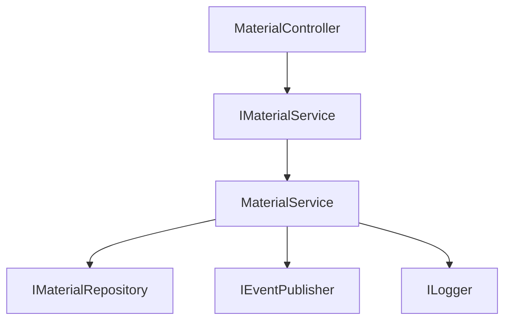

Yes. I’d design this less as a “documentation generator” and more as a **codebase archaeology engine**. The useful part is not generating 500 pages of AI prose nobody reads. It is detecting what exists, what matters, what is undocumented, and what changed.

## Concept: CodeAtlas

**Automated documentation analysis for C# + Vue**

```text
Source Directory
      │
      ▼
┌──────────────────────┐
│  Repository Scanner  │
│  C# / Vue / TS / SQL │
└──────────┬───────────┘
           ▼
┌──────────────────────┐
│   Code Model / AST    │
│                      │
│ Classes              │
│ Methods              │
│ Components           │
│ Dependencies         │
│ Routes               │
│ Services             │
│ DB access            │
│ Events               │
└──────────┬───────────┘
           ▼
┌────────────────────────────┐
│ Documentation Analyzer     │
│                            │
│ Missing docs               │
│ Architecture patterns      │
│ Complexity                 │
│ Coupling                   │
│ Public API                 │
│ Business-critical code     │
│ Architectural violations   │
└────────────┬───────────────┘
             ▼
┌────────────────────────────┐
│ Documentation Generator    │
│                            │
│ API docs                   │
│ Architecture docs          │
│ Component docs             │
│ Dependency diagrams        │
│ Module descriptions        │
│ ADR candidates             │
└────────────┬───────────────┘
             ▼
      Markdown / HTML
```

### 1. Scanner

Start with a simple command:

```bash
codedoc scan ./src
```

Detect:

### C#

* namespaces
* classes / records / structs
* interfaces
* public/protected methods
* constructors
* properties
* events
* enums
* controllers
* minimal API endpoints
* DI registrations
* EF Core entities
* repositories
* services
* HTTP clients
* configuration
* external dependencies
* NuGet dependencies

### Vue / TypeScript

* `.vue` components
* composables
* stores
* services
* API clients
* routes
* props
* emits
* imports
* component hierarchy
* Pinia stores
* dependency relationships

The important bit: **don't initially parse source code with regex.**

Use:

* Roslyn → C#
* TypeScript Compiler API / Vue compiler → Vue/TS

That gives you an actual semantic model instead of the traditional software-engineering technique of hoping regex survives contact with reality.

---

# 2. Build an intermediate Code Model

Everything should eventually become one unified graph.

```text
Project
 ├── Module
 │    ├── Namespace
 │    │    ├── Class
 │    │    │    ├── Method
 │    │    │    └── Property
 │    │    └── Interface
 │    │
 │    └── Dependency
 │
 └── Frontend
      ├── Component
      ├── Store
      ├── Composable
      └── Route
```

And relationships:

```text
Controller
    │
    ▼
Service
    │
    ▼
Repository
    │
    ▼
Database

Vue Component
    │
    ▼
Pinia Store
    │
    ▼
API Client
    │
    ▼
.NET API
```

This graph becomes the foundation for basically everything else.

---

# 3. Documentation detection

This is where I'd make the tool interesting.

Instead of simply asking:

> "Does this method have a comment?"

calculate a **documentation requirement**.

For example:

```text
Method: MaterialRequestService.CreateRequest()

Visibility: public
Called by: 4 components
Called from: Controller
Cyclomatic complexity: 8
Parameters: 6
External side effects: DB + event
Business domain: MaterialRequest

Documentation requirement: HIGH
Documentation status: 20%
```

A trivial method:

```csharp
public int Add(int a, int b)
{
    return a + b;
}
```

doesn't need documentation.

A method like:

```csharp
public async Task<MaterialRequestResult>
    CreateMaterialRequestAsync(...)
```

probably does.

---

# 4. Documentation rules

I'd make these configurable.

Example:

```yaml
rules:

  public_methods:
    require: true

  private_methods:
    require_if:
      complexity: "> 8"

  controllers:
    require: true

  services:
    require: true

  vue_components:
    require_if:
      lines: "> 150"

  architecture:
    require: true

  dependencies:
    require: true
```

Then produce findings:

```text
Documentation Analysis

██████████████████░░ 87%

Critical
────────
12 undocumented public APIs

Warnings
────────
31 complex undocumented methods
8 components without documentation
4 architectural dependencies not documented

Architecture
────────────
3 circular dependencies
2 unexpected layer violations

Documentation
────────────
143 documented
27 partially documented
48 undocumented
```

---

# 5. Architecture detection

This is probably the most valuable feature.

The scanner should infer architecture automatically.

For example:

```text
Frontend
   │
   ├── Components
   ├── Stores
   └── Services
          │
          ▼
       REST API
          │
          ▼
       Controllers
          │
          ▼
       Application
          │
          ▼
       Domain
          │
          ▼
    Infrastructure
```

Then detect violations:

```text
ARCH-001

Domain → Infrastructure dependency

Domain/Material.cs
    ↓
Infrastructure/SqlMaterialRepository.cs

Expected:
Domain → abstraction
Infrastructure → implementation
```

Or:

```text
ARCH-002

Vue component directly accesses HTTP client.

MaterialTable.vue
       ↓
axios

Expected:
Component
   ↓
Store / composable
   ↓
API service
```

That turns documentation into **architecture governance**, which is considerably more useful.

---

# 6. Dependency documentation

Generate something like:

```text
## Material Management

### Dependencies

MaterialController
 ├── IMaterialService
 │    └── MaterialService
 │         ├── IMaterialRepository
 │         └── IEventPublisher
 │
 └── ILogger
```

And automatically generate Mermaid:



For larger systems, generate module-level graphs instead of class-level spaghetti. Humanity has suffered enough from diagrams containing 800 boxes.

---

# 7. Generated documentation structure

I'd generate a documentation tree like:

```text
docs/
├── index.md
│
├── architecture/
│   ├── overview.md
│   ├── backend.md
│   ├── frontend.md
│   ├── dependencies.md
│   └── diagrams/
│
├── backend/
│   ├── controllers/
│   ├── services/
│   ├── domain/
│   └── infrastructure/
│
├── frontend/
│   ├── components/
│   ├── stores/
│   ├── composables/
│   └── routes/
│
├── api/
│   └── endpoints.md
│
└── quality/
    ├── undocumented.md
    ├── complexity.md
    └── architecture-violations.md
```

---

# 8. AI should come last

Don't make the LLM the core of the system.

Use deterministic analysis first:

```text
Source
  ↓
AST
  ↓
Code Graph
  ↓
Rules
  ↓
Facts
  ↓
LLM
  ↓
Human-readable documentation
```

The LLM receives facts such as:

```json
{
  "symbol": "MaterialRequestService.CreateAsync",
  "calledBy": [
    "MaterialRequestController.Create"
  ],
  "dependencies": [
    "IMaterialRepository",
    "IEventPublisher"
  ],
  "sideEffects": [
    "database",
    "event"
  ],
  "complexity": 9
}
```

Then asks it to produce:

```markdown
## CreateAsync

Creates a material request and persists it.

### Responsibilities

- validates the request
- creates the domain entity
- persists the entity
- publishes a material-request-created event

### Dependencies

- `IMaterialRepository`
- `IEventPublisher`

### Side Effects

Creates a database record and publishes an event.
```

Much better than feeding 100,000 lines of source into an LLM and praying to the token-count gods.

---

# 9. Change-aware documentation

This could become a killer feature.

Store a fingerprint of the analyzed code:

```text
Documentation generated:
2026-09-27

Commit:
a82f13e

Code model:
v184
```

On the next scan:

```text
Documentation impact

Changed:
MaterialRequestService.CreateAsync()

Affected documentation:
✓ services/material-request.md
✓ architecture/material-flow.md
✓ api/material-request.md

Potentially outdated:
⚠ architecture/backend.md
```

So CI can say:

```text
Documentation check

23 files changed

Documentation impact:
  2 documentation updates required
  1 architecture change detected
  0 undocumented public APIs introduced

Build: PASS
```

---

# 10. CLI

I'd keep the CLI extremely simple.

```bash
codedoc scan ./src
codedoc analyze ./src
codedoc generate ./src
codedoc diff HEAD~1 HEAD
codedoc serve ./docs
```

And:

```bash
codedoc check ./src
```

for CI.

Example:

```text
CodeDoc

Project: CARGO.Material
Language: C# + Vue

Files             486
Classes           721
Methods           4,812
Vue Components    184
API Endpoints     97

Documentation
────────────────────────────
Public APIs              91%
Services                 74%
Vue Components           68%
Architecture             82%

Issues
────────────────────────────
12  undocumented public APIs
18  high-complexity methods
4   circular dependencies
3   architecture violations

Documentation coverage: 79%
```

---

# 11. The really interesting extension

I'd introduce **documentation patterns** rather than just documentation rules.

For example:

```yaml
patterns:

  service:
    match:
      class_name: "*Service"

    documentation:
      required:
        - purpose
        - dependencies
        - side_effects
        - error_behavior

  controller:
    match:
      attribute: "ApiController"

    documentation:
      required:
        - endpoint
        - authorization
        - input
        - output
        - errors

  vue_component:
    match:
      extension: ".vue"

    documentation:
      required:
        - purpose
        - props
        - emits
        - dependencies
```

That gives you a **domain-specific documentation framework**.

And it means a company can define:

> "This is what documentation means in our architecture."

rather than:

> "Please put XML comments above everything because Sonar said so."

---

## Suggested architecture

For an actual implementation I'd use:

```text
codedoc/
│
├── Core/
│   ├── CodeModel
│   ├── DependencyGraph
│   ├── DocumentationModel
│   └── Rules
│
├── Analyzers/
│   ├── CSharpAnalyzer
│   │    └── Roslyn
│   ├── TypeScriptAnalyzer
│   └── VueAnalyzer
│
├── Architecture/
│   ├── DependencyAnalyzer
│   ├── LayerAnalyzer
│   └── PatternDetector
│
├── Documentation/
│   ├── MarkdownGenerator
│   ├── MermaidGenerator
│   └── HtmlGenerator
│
├── AI/
│   ├── DocumentationGenerator
│   └── ArchitectureExplainer
│
└── CLI/
```

**C#/.NET for the core** makes sense because Roslyn gives you excellent semantic analysis. The Vue analyzer can consume the TypeScript/Vue AST and feed the same unified model.

The key architectural decision I'd make early is this:

> **Don't build a documentation generator. Build a code intelligence model that happens to generate documentation.**

Once you have the code graph, documentation is just one output. The same engine can later produce architecture diagrams, dependency reports, onboarding guides, API documentation, code-review findings, architecture drift detection, and even "explain this subsystem" views.
